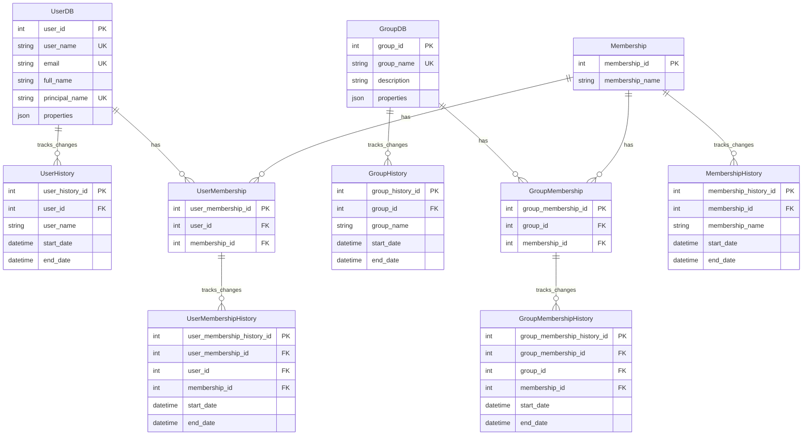

# Portfolio API

A FastAPI backend service that provides user, group, and project management functionality.

## Prerequisites

- Python 3.10 or higher
- pip (Python package installer)

## Setup

1. Create and activate a virtual environment:
```bash
# Windows
python -m venv venv
.\venv\Scripts\activate

# Unix/MacOS
python -m venv venv
source venv/bin/activate
```

2. Install dependencies:
```bash
python -m pip install -r requirements.txt
```

3. Run the development server:
```bash
uvicorn main:app --reload
```

## API Documentation

FastAPI provides automatic interactive API documentation:

- **Swagger UI**: http://localhost:8000/docs
  - Interactive API documentation
  - Try out endpoints directly in the browser
  - View request/response schemas
  - OAuth2 authentication support

- **ReDoc**: http://localhost:8000/redoc
  - Alternative documentation view
  - Better for reading and understanding the API structure
  - Cleaner interface for sharing with stakeholders

- **OpenAPI Schema**: http://localhost:8000/openapi.json
  - Raw OpenAPI (Swagger) specification
  - Can be imported into other API tools
  - Used for generating client libraries





